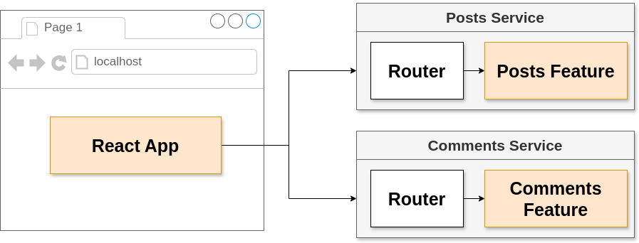
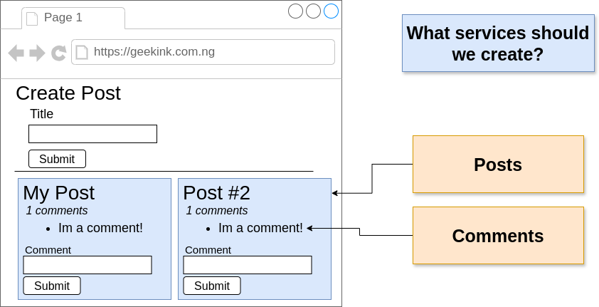
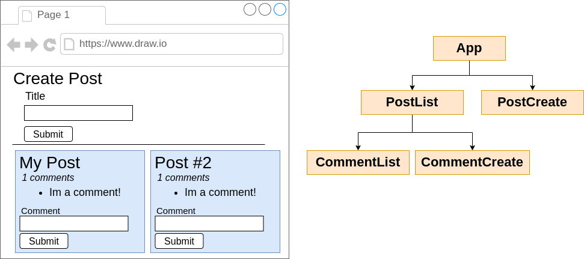
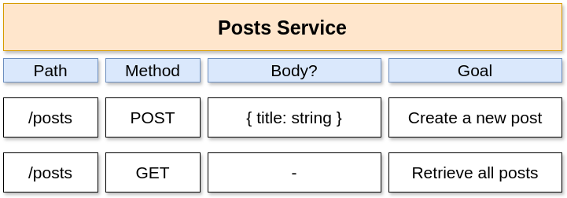
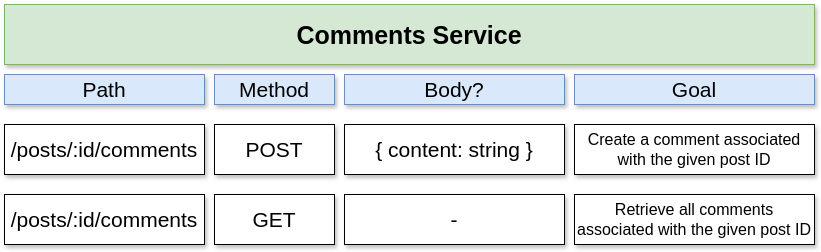

# Simple Blogs using Microservices

## Note on this project

### Goals:
1. Get a test of micro services architecture
2. Build as much as possible from scratch

## Micro Services Blogs Overview

| Section             | Image                           |
|---------------------|---------------------------------|
| **Project Overview** |                     |
| **Architecture**     |               |

## Micro Services

| Service             | Image                           |
|---------------------|---------------------------------|
| **Microservice Architecture** |      |

### Client

| Client Section       | Image                           |
|----------------------|---------------------------------|
| **Client Architecture** |              |
| **React Setup**        |              |

### Post Service

| Post Service Section | Image                           |
|----------------------|---------------------------------|
| **Post Service Architecture** |         |

### Comment Service

| Comment Service Section | Image                           |
|-------------------------|---------------------------------|
| **Comment Service Architecture** |      |
