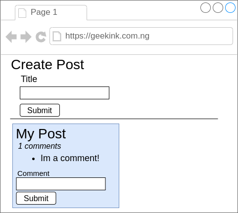
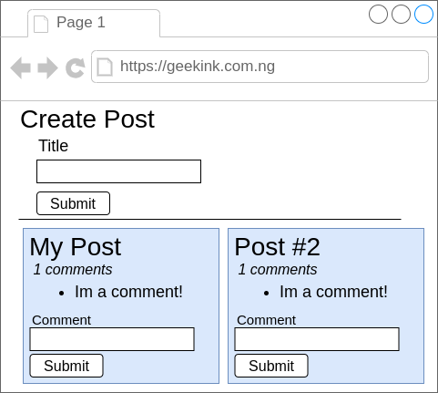

# Simple Blogs using micro servive

## Note on this project

### Goals:
1. Get a test of micro services architecture

2. Build as much as possible form scratch 

## markup

## Micro Services

### Client

### Post Service

### Comment Service

